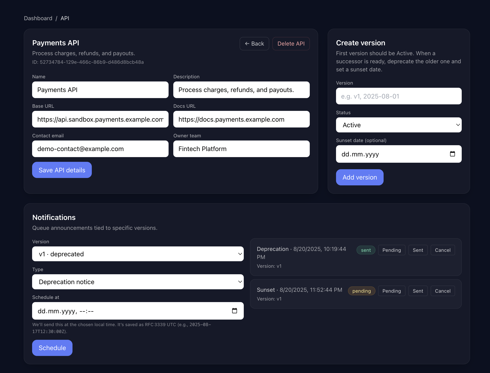

# 🧩 Smelinx

**Smelinx** is an open-source platform for API lifecycle management. It helps teams **register APIs, track versions, schedule deprecations, and notify consumers automatically** — so you ship faster while keeping clients aligned.

- ✅ Open-source • Self-hostable • Minimal setup
- ✉️ Automated email notices via **SendGrid**
- 📊 Dashboard for APIs, versions & scheduled notifications

## 🚀 Why Smelinx?

Managing API changes is hard. Teams often struggle with:
- **Lost consumers** who miss deprecation announcements
- **Manual tracking** of API versions and timelines
- **Communication gaps** between API producers and consumers
- **Breaking changes** that catch users off guard

Smelinx automates the entire process, ensuring smooth API evolution without surprises.

## ✨ Features

- **Centralized Registry** – Manage all your APIs with owners and metadata
- **Version Lifecycle** – Mark versions Active, Deprecated, or Sunset with clear timelines
- **Automated Notices** – Send deprecation/sunset emails at the right time
- **Consumer Tracking** – Keep track of who's using what version
- **Insights Dashboard** – See adoption, migrations, and upcoming sunsets at a glance
- **Team Collaboration** – Multiple owners, role-based permissions

## 📸 Screenshots

### Main Dashboard

*Overview of all your APIs, versions, and upcoming notifications*

### Notification Scheduling

*Schedule and track automated deprecation notices*

## 🧭 Getting Started

### Option A — Try the Demo (No Signup Required!)

Want to see Smelinx in action first? 

1. Visit **[smelinx.com](https://smelinx.com)**
2. Click **"Try Demo"** on the signup page
3. Explore the full dashboard with sample data
4. No email required - just instant access! 🎯

### Option B — Hosted Platform 

Ready to manage your own APIs:

1. Visit **[smelinx.com](https://api.smelinx.com)**
2. Sign up for free
3. Create your first API
4. Start managing versions and notifications

### Option C — Self-host with Docker

Perfect for teams wanting full control over their data:

#### Prerequisites
- Docker and Docker Compose
- SendGrid account (for email notifications)

#### Installation

1. **Clone repository**

   ```bash
   git clone https://github.com/Niranjini-Kathiravan/smelinx.git
   cd smelinx
   ```

2. **Configure environment**
   
   Create `smelinx-api/.env`:
   ```env
   SENDGRID_API_KEY=your_sendgrid_api_key
   SENDER_EMAIL=noreply@yourdomain.com
   DATABASE_URL=./smelinx.db
   ```
   
   Create `smelinx-web/.env.local`:
   ```env
   NEXT_PUBLIC_API_URL=http://localhost:8080
   ```

3. **Launch**

   ```bash
   docker compose up -d --build
   ```

4. **Access your instance**
   - Frontend: http://localhost:3000
   - Backend API: http://localhost:8080

## 🧪 Quick Test

Verify everything works:

1. Open http://localhost:3000 and sign up or use https://api.smelinx.com 
2. Create an API entry with your email as contact
3. Add version `v1.0` (status: Active)
4. Schedule a deprecation notice for yesterday
5. Check your inbox - you should receive the notification! 🎉


## 🏗️ Tech Stack

- **Frontend** — Next.js 14 (App Router) + TailwindCSS + TypeScript
- **Backend** — Go 1.21 + Chi Framework
- **Database** — SQLite (production-ready, easy backups) + easy migration to PostgreSQL
- **Email** — SendGrid integration

## 🤝 Contributing

We welcome contributions! Here's how to get involved:

1. **Fork** the repository
2. **Create** a feature branch (`git checkout -b feature/amazing-feature`)
3. **Commit** your changes (`git commit -m 'Add amazing feature'`)
4. **Push** to the branch (`git push origin feature/amazing-feature`)
5. **Open** a Pull Request

### Development Setup

```bash
# Backend
cd smelinx-api
go mod tidy
go run main.go

# Frontend  
cd smelinx-web
npm install
npm run dev
```


## 🐛 Issues & Support

- **Bug reports**: [GitHub Issues](https://github.com/Niranjini-Kathiravan/Smelinx/issues)
- **Feature requests**: [GitHub Discussions](https://github.com/Niranjini-Kathiravan/Smelinx/discussions)
- **Community**: [Discord Server](https://discord.gg/smelinx) *(coming soon)*

## 📄 License

MIT License - see [LICENSE](LICENSE) file for details.

---

**Made with ❤️ by the Smelinx team**

⭐ **Star us on GitHub if Smelinx helps your team!**